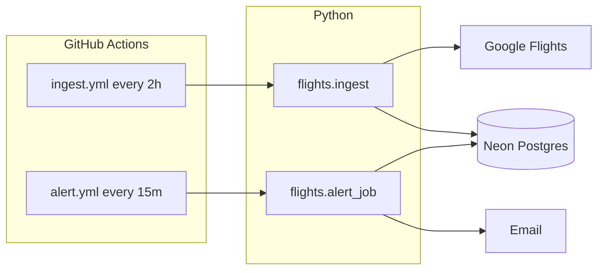

# my-flight-tracker (TLV ↔ VIE)

Track **direct** economy flights for **2 passengers** (USD), store history in **Neon Postgres**, run **scheduled ingest** on GitHub Actions, and get **email alerts** when a one-way leg drops below **$250**.

## Architecture



**Data model (high level)**

| Table | Purpose |
|--------|---------|
| `ingest_runs` | Canonical ingest log (`status`, `error`, `records_count`) |
| `scrape_runs` | Legacy-compatible run ids (same id as ingest) |
| `offers` | Raw one-way legs per run (analysis/MCP) |
| `leg_observations` | Idempotent leg prices (`observed_at_bucket` = 30 min UTC) |
| `alerts` | Low-price legs + ingest failures |
| `notification_state` | Rate limit (e.g. one ingest-failed email / 24h) |

## Quick start (local)

```powershell
cd C:\Users\Avishay\projects\agents-mcp-intensive
.\.venv\Scripts\python.exe -m pip install -r requirements.txt
playwright install chromium
copy config.example.yaml config.yaml
# .env: DATABASE_URL + SMTP_* (see .env.example)

.\.venv\Scripts\python.exe -m flights.db init
.\.venv\Scripts\python.exe scripts\check_env.py
.\.venv\Scripts\python.exe -m flights.ingest --provider mock --once --max-days 5
.\.venv\Scripts\python.exe -m flights.alert_job
.\.venv\Scripts\python.exe -m flights.db stats
```

## GitHub Actions

Repo: [avishayal-source/my-flight-tracker](https://github.com/avishayal-source/my-flight-tracker)

**Secrets** (Settings → Secrets and variables → Actions):

- `DATABASE_URL` — Neon connection string  
- `ALERT_EMAIL_TO`, `ALERT_EMAIL_FROM`, `SMTP_HOST`, `SMTP_PORT`, `SMTP_USER`, `SMTP_PASSWORD`

| Workflow | Schedule (UTC) | Command |
|----------|----------------|---------|
| `ingest.yml` | `0 */2 * * *` | Google ingest, 14 days from offset 3 |
| `alert.yml` | `*/15 * * * *` | Check DB, email on **new** alerts |

Manual run: **Actions** → workflow → **Run workflow**.

### If ingest fails on GitHub Actions

1. **Ignore the Node.js 20 deprecation banner** — that is a warning, not the failure. The real error is under the **Run ingest** step (red X).
2. Common causes: Google blocking datacenter IPs, Playwright timeout, or missing/wrong `DATABASE_URL` secret.
3. On failure, download the **ingest-debug-*** artifact (screenshots in `data/debug/`).
4. CI uses `--max-days 7` (not 14) to stay within the job timeout.

## Docker

```bash
docker build -t my-flight-tracker .
docker run --env-file .env -e JOB=ingest my-flight-tracker
docker run --env-file .env -e JOB=alert my-flight-tracker
```

## MCP & CLI agent (optional)

Cursor MCP: `flights-tracker` via `scripts/run_flights_mcp.py` (requires `DATABASE_URL`).

```powershell
.\.venv\Scripts\python.exe -m flights.agent_cli "Cheapest 4-day round trip?"
```

## Alerts

- **Low price:** any **one-way leg** in the latest successful scrape with total **&lt; $250** (2 pax USD). Email only for **new** `(route, date, flight)` rows in `alerts`.  
- **Ingest failed:** if the latest `ingest_runs.status = error`, at most **one email per 24 hours**.

## Docs

- [MONITORING.md](MONITORING.md) — local watch mode  
- [REAL_DATA.md](REAL_DATA.md) — Playwright / Google  
- [PLAN.md](PLAN.md) — bootcamp steps  

## Push to GitHub

```powershell
git remote add origin https://github.com/avishayal-source/my-flight-tracker.git
git push -u origin main
```

(If `origin` already exists, use `git remote set-url origin ...`.)
